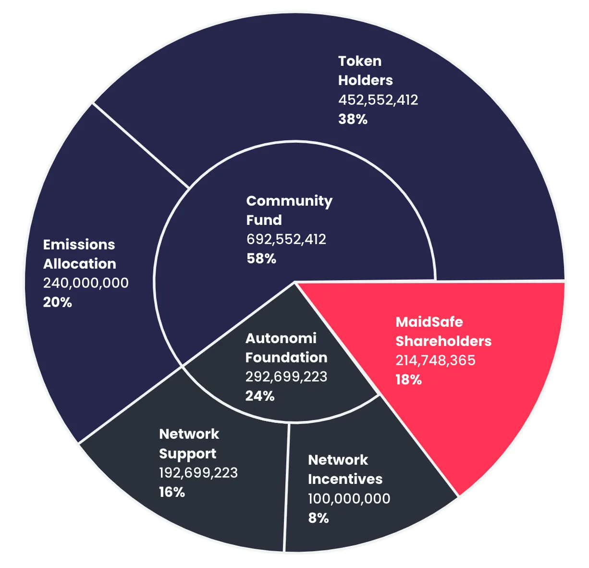

---
metaLinks:
  alternates:
    - >-
      https://app.gitbook.com/s/T1VY0u5KuOsTpycHpSka/how-it-works/network-economics/token-supply
---

# Token Supply



<figure><figcaption></figcaption></figure>

#### Token Holders

MaidSafeCoin (also known and referred to as ‘OMNI MAID’) was the origin token of the MaidSafe project, at the time known as The SAFE Network. It was issued as part of a crowd-sale in April of 2014 (MaidSafeCoin was the 10th crypto token ever to launch). These tokens have a 1:1 relationship to Autonomi tokens ($AUTONOMI) and Autonomi’s future ‘Native Token’. Token holders also include those with ‘EMAID’ (the current ERC-20 token), these holders will be ‘airdropped’ Autonomi tokens 1:1 at or shortly following The Network’s Token Generation Event (TGE), following an advised ‘wallet’ snapshot. Also included in this the group of ‘Token Holders’ are those who have earned token allocations via network testing incentives and reward programs prior to TGE —- these participants, will receive Autonomi tokens at a ratio of 1:1 to ‘Test Tokens’.

This allocation represents 38% of the Maximum Supply, an increase of 8% from 1.0 of the White Paper.

#### Emissions Allocation

In the early years of The Network especially there is need and therefore an allocation for emissions - governed by a smart contract. Based on community feedback this pool has been reduced to 240,000,000 tokens (20% of Max Supply), which will be emitted over a 12 year period. This is a change from 3,167,866,884 tokens, representing 70% of the Maximum Supply, which was to be emitted (at a diminishing rate) over a period of 30 years.&#x20;

#### Autonomi Foundation

The Autonomi Foundation (formerly known as the SAFE Foundation), will play a critical role in enhancing the network through 3 specific areas of activity:

1. **Network Support:** via marketing and partnerships (including but not limited to centralized exchange requirements and liquidity provisions)
2. **Network Support:** via network team responsible for improvements and key developments - Native Token, Mobile Nodes and Upgrades
3. **Network Incentive:** via reward and incentive payments to network applications, builders and supporters

The Autonomi Foundation will receive payments via a Smart Contract with allocated amounts that will unlock over a 50 year period:

* Year 1: 20%
* Year 2-5: 34%
* Year 6-12: 31%
* Year 13-50: 15%

**MaidSafe Shareholders**

Shareholders have been allocated 214,748,365 tokens which will be distributed after TGE.
